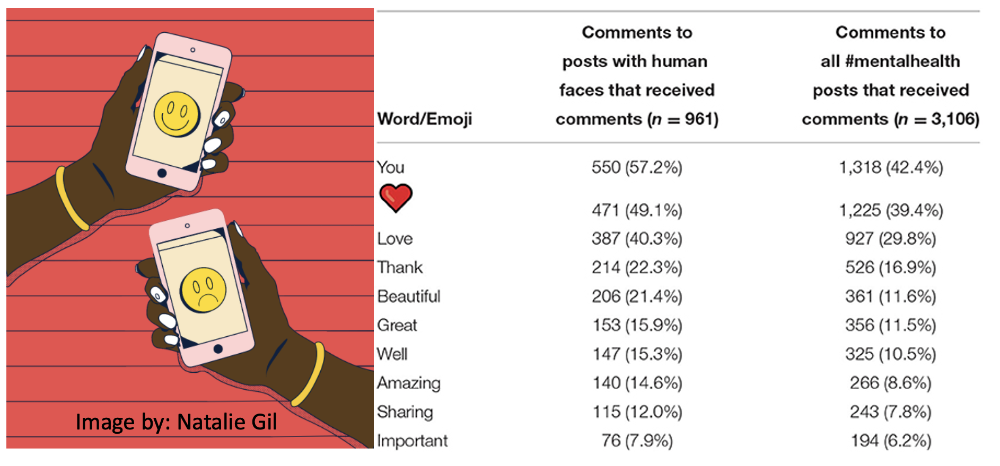

#### [1. The Impact of Influencers on Cigar Promotions: A Content Analysis of Large Cigar and Swisher Sweets Videos on TikTok](https://pubmed.ncbi.nlm.nih.gov/35742315/)

**Background**: Little is known about the content, promotions, and individuals in cigar-related videos on TikTok. 
 
**Methods**: TikTok videos with large cigar and Swisher Sweets-related hashtags between July 2016 and September 2020 were analyzed. Follower count was used to identify influencers. We compared content characteristics and demographics of featured individuals between cigar types, and by influencer status. We also examined the association between content characteristics and video engagement. 
 
**Results**: Compared to large cigar videos, Swisher Sweets videos were more likely to feature arts and crafts with cigar packages, cannabis use, and flavored products. In addition, Swisher Sweets videos were also more likely to feature females, Black individuals, and younger individuals. Both Swisher Sweets and large cigar influencers posted more videos of cigar purchasing behaviors than non-influencers, which was associated with more video views. None of the videos disclosed sponsorship with #ad or #sponsored. 
 
**Implications**: Videos containing the use of cigar packages for arts and crafts, and flavored products highlight the importance of colorful packaging and flavors in the appeal of Swisher Sweets cigars, lending support for plain packaging requirements and the prohibition of flavors in cigar products to decrease the appeal of cigars. The presence and broad reach of cigar promotions on TikTok requires stricter enforcement of anti-tobacco promotion policies. 
&nbsp;
&nbsp;
&nbsp;
&nbsp;

---
#### [2. The Picture of #Mentalhealth on Instagram: Congruent vs. Incongruent Emotions in Predicting the Sentiment of Comments](https://www.frontiersin.org/articles/10.3389/fcomm.2022.824119/full?utm_source=S-TWT&utm_medium=SNET&utm_campaign=ECO_FCOMM_XXXXXXXX_auto-dlvrit)

**Background**: This study explores the effects of sentiment of Instagram images and captions on the sentiment of comments. 
 
**Methods**: All Instagram posts with the hashtag #mentalhealth and the associated metadata were scraped on World Mental Health Day. A mixed-method approach of a sentiment classifier and a quantitative content analysis of Instagram posts (N = 7,078) was used. 
 
**Results**: COverall, our sample contained more positive sentiment posts and comments than negative ones, indicating a possible connection between mental health-related discourse and positive sentiment on Instagram. Images containing faces elicited more likes, comments and positive comments compared with images without faces. MANCOVA analyses of images with human faces found that emotional contagion from Instagram posts to comments was only observed when considering the sentiment of both images and captions. Congruency effects were seen for posts with both negative captions and images, which elicited more negative comments compared to emotionally incongruent posts. 
 
**Implications**: The findings of this study may be helpful to practitioners interested in using Instagram to maximize the emotional reactions from the targeted audience for the communication and prevention of mental health issues.  
&nbsp;
&nbsp;
&nbsp;
&nbsp;

 
