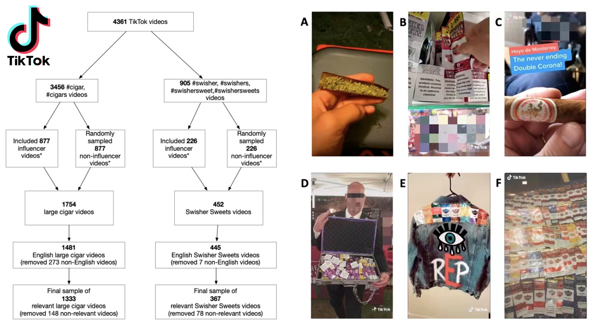

#### [The Impact of Influencers on Cigar Promotions: A Content Analysis of Large Cigar and Swisher Sweets Videos on TikTok](https://pubmed.ncbi.nlm.nih.gov/35742315/)

**Background**: Little is known about the content, promotions, and individuals in cigar-related videos on TikTok. 
**Methods**: TikTok videos with large cigar and Swisher Sweets-related hashtags between July 2016 and September 2020 were analyzed. Follower count was used to identify influencers. We compared content characteristics and demographics of featured individuals between cigar types, and by influencer status. We also examined the association between content characteristics and video engagement. 
**Results**: Compared to large cigar videos, Swisher Sweets videos were more likely to feature arts and crafts with cigar packages, cannabis use, and flavored products. In addition, Swisher Sweets videos were also more likely to feature females, Black individuals, and younger individuals. Both Swisher Sweets and large cigar influencers posted more videos of cigar purchasing behaviors than non-influencers, which was associated with more video views. None of the videos disclosed sponsorship with #ad or #sponsored. 
**Implications**: Videos containing the use of cigar packages for arts and crafts, and flavored products highlight the importance of colorful packaging and flavors in the appeal of Swisher Sweets cigars, lending support for plain packaging requirements and the prohibition of flavors in cigar products to decrease the appeal of cigars. The presence and broad reach of cigar promotions on TikTok requires stricter enforcement of anti-tobacco promotion policies. 

&nbsp;
&nbsp;
&nbsp;
&nbsp;
&nbsp;
&nbsp;
&nbsp;
