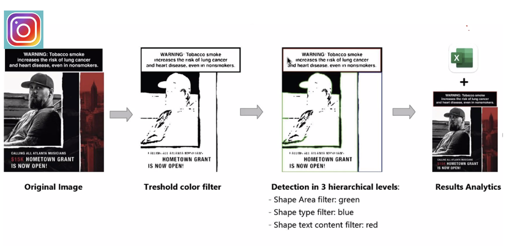

#### [1. The Impact of Influencers on Cigar Promotions: A Content Analysis of Large Cigar and Swisher Sweets Videos on TikTok](https://pubmed.ncbi.nlm.nih.gov/35742315/)

**Background**: Little is known about the content, promotions, and individuals in cigar-related videos on TikTok. 
 
**Methods**: TikTok videos with large cigar and Swisher Sweets-related hashtags between July 2016 and September 2020 were analyzed. Follower count was used to identify influencers. We compared content characteristics and demographics of featured individuals between cigar types, and by influencer status. We also examined the association between content characteristics and video engagement. 
 
**Results**: Compared to large cigar videos, Swisher Sweets videos were more likely to feature arts and crafts with cigar packages, cannabis use, and flavored products. In addition, Swisher Sweets videos were also more likely to feature females, Black individuals, and younger individuals. Both Swisher Sweets and large cigar influencers posted more videos of cigar purchasing behaviors than non-influencers, which was associated with more video views. None of the videos disclosed sponsorship with #ad or #sponsored. 
 
**Implications**: Videos containing the use of cigar packages for arts and crafts, and flavored products highlight the importance of colorful packaging and flavors in the appeal of Swisher Sweets cigars, lending support for plain packaging requirements and the prohibition of flavors in cigar products to decrease the appeal of cigars. The presence and broad reach of cigar promotions on TikTok requires stricter enforcement of anti-tobacco promotion policies. 
&nbsp;
&nbsp;
&nbsp;
&nbsp;

---
#### [2. The Picture of #Mentalhealth on Instagram: Congruent vs. Incongruent Emotions in Predicting the Sentiment of Comments](https://www.frontiersin.org/articles/10.3389/fcomm.2022.824119/full?utm_source=S-TWT&utm_medium=SNET&utm_campaign=ECO_FCOMM_XXXXXXXX_auto-dlvrit)

**Background**: This study explores the effects of sentiment of Instagram images and captions on the sentiment of comments. 
 
**Methods**: All Instagram posts with the hashtag #mentalhealth and the associated metadata were scraped on World Mental Health Day. A mixed-method approach of a sentiment classifier and a quantitative content analysis of Instagram posts (N = 7,078) was used. 
 
**Results**: Overall, our sample contained more positive sentiment posts and comments than negative ones, indicating a possible connection between mental health-related discourse and positive sentiment on Instagram. Images containing faces elicited more likes, comments and positive comments compared with images without faces. MANCOVA analyses of images with human faces found that emotional contagion from Instagram posts to comments was only observed when considering the sentiment of both images and captions. Congruency effects were seen for posts with both negative captions and images, which elicited more negative comments compared to emotionally incongruent posts. 
 
**Implications**: The findings of this study may be helpful to practitioners interested in using Instagram to maximize the emotional reactions from the targeted audience for the communication and prevention of mental health issues.  
&nbsp;
&nbsp;
&nbsp;
&nbsp;

---
#### 3. Health Warning Labels Associate with Less Engagement in Little Cigar and Cigarillo Instagram Promotions: Using Computer Vision to Detect FDA Guidelines (under review)

**Background**: Little is known regarding the current state of influencer promotions of little cigars and cigarillos on Instagram and the use of health warnings in influencer promotions. 
 
**Methods**: Instagram influencers were identified as those who were tagged by any of the top three little cigar and cigarillo brand Instagram pages between January 2018 and November 2021. Posts from identified influencers that mentioned one of the three brands were considered little cigar and cigarillo influencer promotions. A mixed-method approach of manual coding and computer vision was performed to measure the presence and properties of health warnings in a sample of 889 influencer posts. Negative binomial regressions were performed to examine the associations of health warning properties with post engagement. 
 
**Results**: Computer vision was 99.3% accurate in detecting the presence of health warnings. Only 8.2% (n = 73) of little cigar and cigarillo influencer posts included a health warning. Negative binomial results showed posts that contained health warnings received fewer likes (IRR = 0.59, CI = 0.49, 0.71) and comments (IRR = 0.47, CI = 0.32, 0.68). 
 
**Conclusions**: Health warnings are rarely used by influencers tagged on little cigar and cigarillo brand accounts. Very few influencer posts met the FDA health warning requirement of size and placement for tobacco advertising. The presence of a health warning was associated with lower online engagement. Using an innovative computer vision approach to detect health warning labels in influencer promotions on social media is a novel strategy for monitoring health warning compliance in online tobacco promotions. 
 
**Implications**: Health warnings in tobacco advertising provide health information while also increasing the perceived risks of tobacco use. However, existing federal laws requiring warnings on advertisements for tobacco products do not specify whether the rules apply to social media promotions. Our study provides support for the implementation of comparable health warning requirements to social media tobacco promotions. 

&nbsp;
&nbsp;
&nbsp;
&nbsp;

