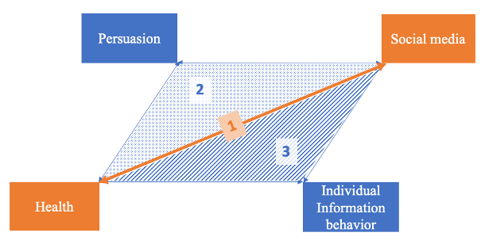

## Research interests

My research interests, as shown in the Figure below, center around two disciplines: health and social media, which formed my first research area: **1) the interplay between public health and social media**. My second research area builds on the first by incorporating the concept of persuasion, namely, **2) health persuasion on social media**. My third research area concerns **3) individual information behaviors on social media**, including the seeking, sharing, and avoidance of health information on social media. 

/>
**(Figure 1.my three research interests and areas)**

I use **mixed methods**, especially quantitative and computational methods to study how communications from advertising campaigns, news reports, social media discussions, and misinformation shape public health issues such as tobacco control, vaccine promotion and mental health.

My **[ATRAC fellowship](https://professional.heart.org/en/research-programs/a-trac) projects** primarily examined how tobacco promotions on emerging social media impact attitudes, beliefs, and behaviors related to tobacco use among youths and underrepresented populations. Using social media analytics and big data, I studied the promotions of flavored cigar products on social media (i.e., TikTok, Twitter, Instagram), the compliance of health warning requirements in tobacco influencer Instagram posts, the impact of influencers in tobacco promotions, and how such promotions may disproportionately target and influence health perceptions among youth and underrepresented populations.

My **dissertation studies** focus on developing effective vaping prevention and cessation campaigns on TikTok, a youth-appealing social media platform. Specifically, my dissertation investigates on the impact of message frames (loss vs. gain) in anti-vaping campaigns. Previous literature reviews of studies on health message frames have reported contradictory and inconsistent findings. My dissertation seeks to capture the illusive message framing effect by 1) proposing to differentiate between prevention behaviors and cessation behaviors, 2) identifying potential moderators especially at the individual level that may reveal the message framing effect, and 3) investigating the congruency effect between message frames and message kernel states (the description of desirable/undesirable outcomes).

## Research Areas
Health communication and promotion  
Health equity 
Computer-mediated-communication 
Media psychology 
Media uses and effects 
Tobacco regulatory science 

&nbsp;
&nbsp;
&nbsp;
&nbsp;
&nbsp;
&nbsp;
&nbsp;
&nbsp;
&nbsp;
&nbsp;
&nbsp;
&nbsp;
&nbsp;
&nbsp;
&nbsp;
&nbsp;
